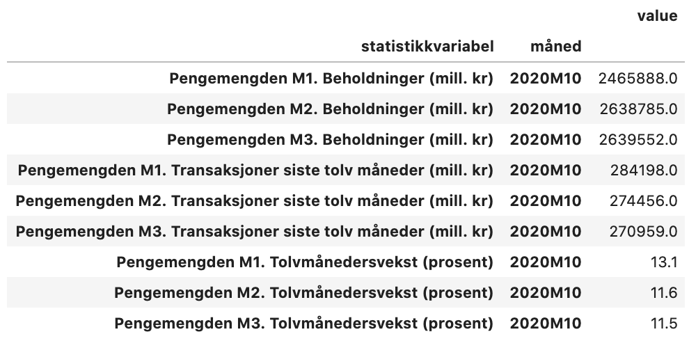
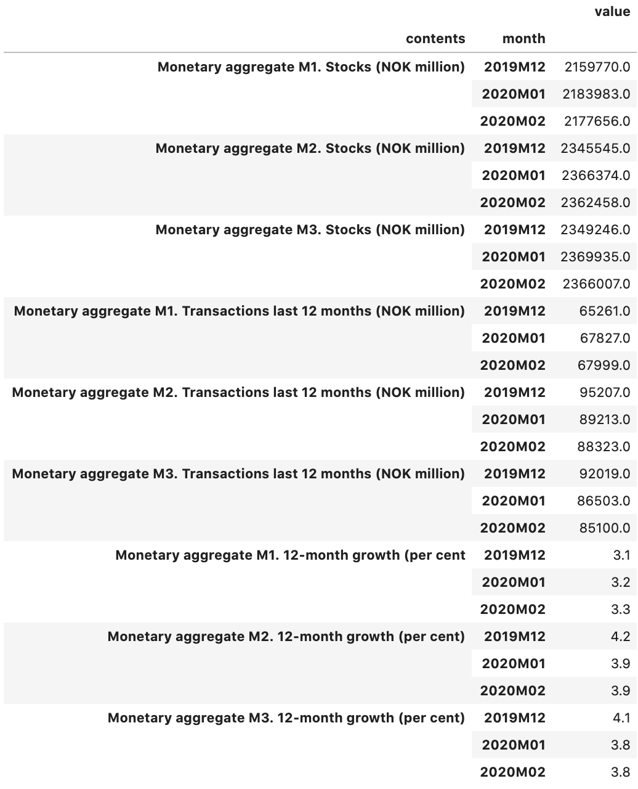
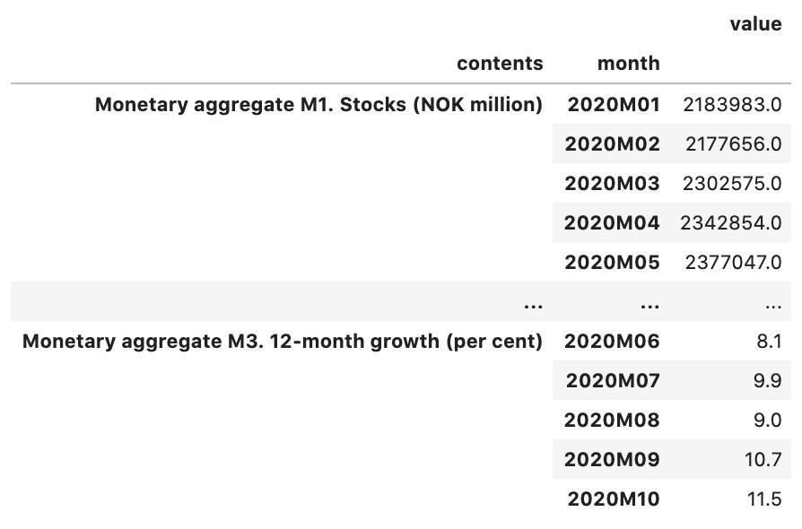
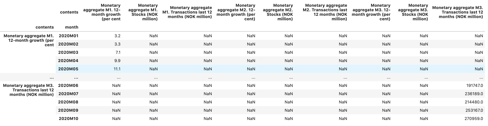
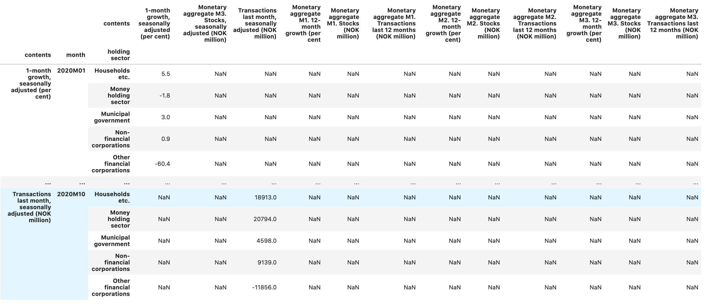

# fetcha

```python
import fetcha as fetcha

# 10945 refers to the SSB-table https://www.ssb.no/en/statbank/table/10945
ssb_10945 = fetcha.SSB("10945", language="en")

# fetch latest period
ssb_10945.fetch().df
```

Returns pandas data frame with index set.

</img>

```python
# fetch specific periods
ssb_10945.fetch(["2019M12", "2020M01", "2020M02"]).df
```

</img>

```python
# Fetch whole year of data
ssb_10945.fetch("2020").df
```

</img>

```python
# Fetch and pivot
ssb_10945.fetch("2020").pivot()
```

</img>

```python
# Fetch and join
ssb_10948 = fetcha.SSB("10948")
ssb_10948.fetch("2020").pivot().join(ssb_10945.fetch("2020").pivot())
```

</img>